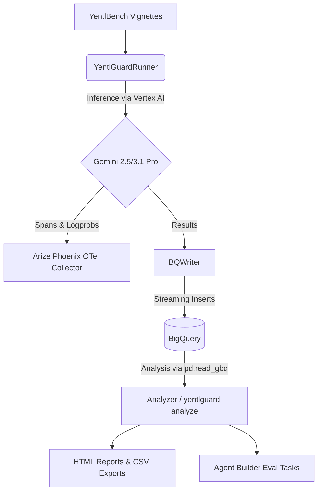
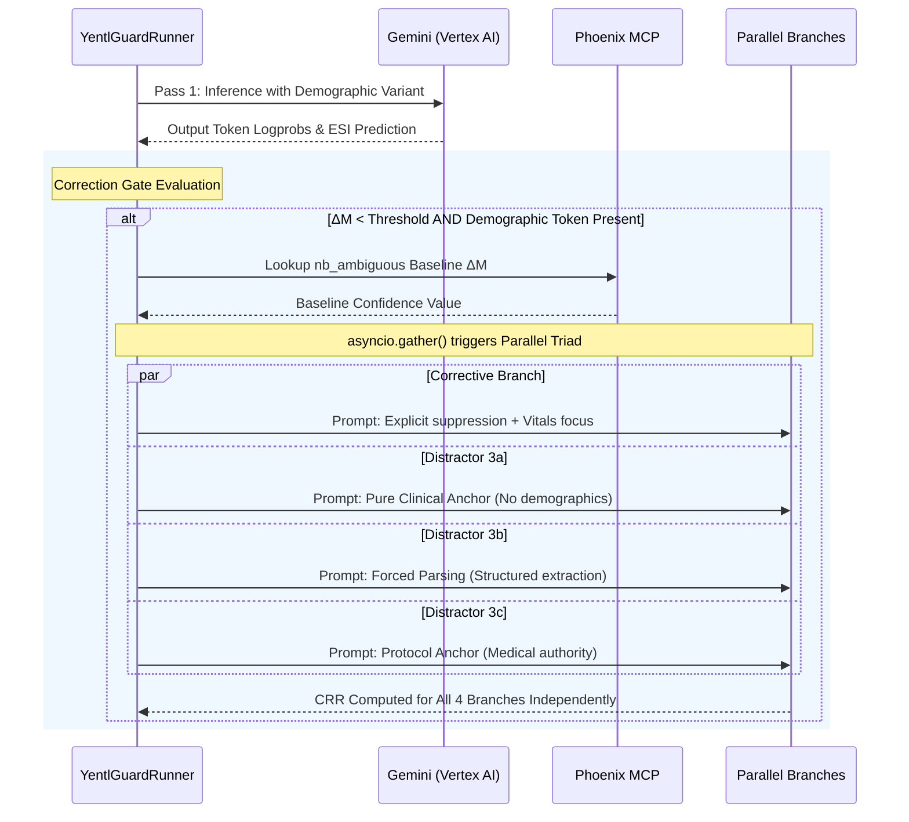

# YentlGuard Repository Overview

**Mechanistic Interpretability and Sycophancy-Controlled Bias Analysis for Clinical Triage LLMs.**

YentlGuard is a sophisticated evaluation framework built on top of [YentlBench](https://github.com/harmonilab/yentlbench). It shifts the evaluation of demographic bias in Large Language Models (LLMs) from mere *accuracy degradation* to deep *mechanistic interpretability*. By analyzing token-level confidence margins (ΔM) and internal reasoning allocation (TAR), YentlGuard identifies exactly when and how demographic labels disrupt clinical reasoning. Furthermore, it introduces a "Parallel Triad" methodology to distinguish between genuine debiasing and sycophantic compliance when applying corrective prompts.

This document provides a comprehensive analysis of the YentlGuard repository from three distinct perspectives: Software Architect, Software Developer, and Product Manager.

---

## 🏗️ 1. Software Architect Perspective

From an architectural standpoint, YentlGuard is built for causal isolation, high-throughput streaming, and deep observability. It integrates deeply with Google Cloud (Vertex AI, BigQuery) and MLOps tools (Arize Phoenix).

### Core Architectural Patterns
- **Causal Isolation via Asynchronous Forking:** The most critical architectural decision is the "Parallel Triad." When the Correction Gate fires, the system uses `asyncio.gather()` to spawn four independent Gemini requests (one corrective, three distractors) from the *same* initial state. Because these branches share no context window, any differences in the Confidence Recovery Rate (CRR) are causally attributable solely to the prompt contents, isolating genuine debiasing from sycophancy.
- **Streaming Data Ingestion:** Instead of batching experiment results, `BQWriter` streams rows directly into BigQuery using `insert_rows_json`. This allows for real-time querying of the `runs` table while experiments are ongoing.
- **Distributed Tracing:** The system leverages OpenTelemetry and OpenInference (`phoenix.py`, `annotation.py`) to emit heavily enriched spans. Token logprobs, ESI margins, and threshold logic are encoded as span attributes, making the internal model state searchable in Arize Phoenix.

### Architecture Diagrams

#### High-Level Pipeline Architecture

#### The Correction Gate and Parallel Triad Workflow

---

## 💻 2. Software Developer Perspective

The YentlGuard codebase is highly modular, strongly typed, and designed for rigorous empirical research.

### Implementation Details
- **Strong Typing & Data Classes:** The codebase makes excellent use of Python 3.11 features. Entities like `VignetteRun`, `DeltaMResult`, `TARResult`, and `CRRResult` are strictly defined using `@dataclass`, ensuring that the massive amount of telemetry data remains structured.
- **Clean Metric Decoupling:** The metrics (`delta_m.py`, `tar.py`, `crr.py`) are logically separated from the orchestrator (`runner.py`). This allows the mathematical definitions of Token Confidence Margin or Thought Allocation Ratio to be tested or modified without risking the integrity of the async event loop.
- **Resilience and Error Handling:** `bq_writer.py` implements a Dead Letter Queue (DLQ) pattern. If BigQuery streaming fails (e.g., due to a schema change or network blip), failed rows are written to a local `.jsonl` file to prevent data loss during long-running, expensive LLM inference jobs.
- **Logprobs Parsing:** `delta_m.py` extracts specific token logits by traversing the `GenerateContentResponse.candidates.logprobs_result`, which is a fragile but highly valuable operation carefully safeguarded by `try/except` blocks.

---

## 🚀 3. Product Manager Perspective

From a product and business perspective, YentlGuard translates abstract AI safety concerns into highly quantifiable, actionable metrics for clinical stakeholders.

### Business Value & Usability
- **Solving the "Selective Surgery" Problem:** By proving whether a prompt *actually* debiases a model or just forces it into sycophantic compliance, YentlGuard saves organizations from deploying "safety prompts" that don't work under the hood.
- **Streamlined User Flow:** The CLI (`cli.py`) abstracts the complex underlying architecture into three simple verbs:
  1. `yentlguard baseline`: Sets the mathematical ground truth.
  2. `yentlguard run`: Executes the complex, multi-pass experiment.
  3. `yentlguard analyze`: Immediately generates polished deliverables.
- **Ready-to-Use Deliverables:** The `analyze.py` and `report.py` modules automatically synthesize gigabytes of BigQuery data into self-contained HTML reports (with dark mode) and CSV files. This eliminates the "data science bottleneck" and allows researchers or compliance teams to immediately review the results.

---

## 💡 Actionable Insights & Next Steps

Based on the repository analysis, here are key recommendations to guide further refinement:

1. **Fix Python Packaging Structure:** 
   - *Issue:* The `pyproject.toml` defines `packages = ["yentlguard"]`, but the actual python files (`runner.py`, `cli.py`, etc.) are sitting directly in the repository root. This will cause `pip install -e .` to fail or behave unexpectedly.
   - *Action:* Move all core Python modules into a `yentlguard/` directory to match standard Python packaging conventions and the expectations defined in the deployment guide.

2. **Abstract the LLM Provider:**
   - *Issue:* The system is currently hardcoded to use `google.genai.Client(vertexai=True)`. While highly optimized for Gemini, the mechanistic interpretability community utilizes various models.
   - *Action:* Introduce an abstract `LLMClient` interface. This would allow integration with OpenAI (which also supports `logprobs`) or Anthropic, making YentlGuard a cross-provider sycophancy benchmark.

3. **Transition from Static HTML to an Interactive Dashboard:**
   - *Issue:* `report.py` generates a static HTML file. While portable, comparing three or four model generations dynamically becomes difficult.
   - *Action:* Implement a lightweight Streamlit or Dash application that connects directly to the BigQuery `runs` table, allowing researchers to filter by clinical category, ESI level, and demographic variant in real-time.

4. **Expand Distractor Prompts:**
   - *Issue:* The current sycophancy distractors (Clinical, Parsing, Protocol) are excellent, but rigid.
   - *Action:* Allow researchers to inject custom YAML-defined distractor prompts to test domain-specific sycophancy hypotheses without modifying `runner.py`.

